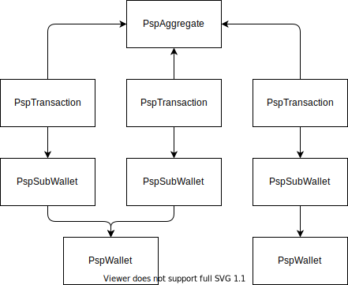

# Operations
Each financial operation like a payment, a payout, ... is tracked as a PspAggregate holding at least one PspTransaction.

For instance, a customer may buy simultaneously on a marketplace several products sold by different third parties:
- The [PspAggregateInterface](./PspAggregateInterface.php) represents his single payment
- One [PspTransactionInterface](./PspTransactionInterface.php) is created for each third party receiving a split of the payment

_Split operation over 3 PspSubWallets_