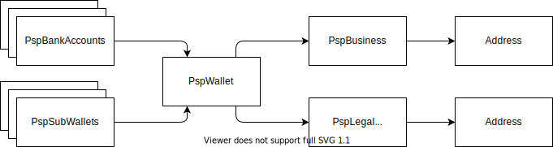

# Concepts

PHPSP defines several data interfaces to implement these concepts:
- [Bank accounts](./BANK_ACCOUNT.md)
- [Operations](./OPERATION.md)
- [Wallet data](./WALLET.md)
- [KYC events](./KYC.md)

_Main concepts_

## Identifiers

### appId & pspId
* `appId` is the reference of the data in the app referential and is generated by the app.
* `pspId` is the reference of the data in the PSP referential and is generated by the PSP.

For instance, when your app registers a new PspWallet at the PSP:
1. Instanciate an instance of `PspWalletInterface` with an `appId` your app has generated
2. Register this PspWallet at the PSP of your choice with the PspWalletService
3. The PSP will generated an id in its own database that is stored as the `pspId` (sometimes asynchronously) 

### pspName
Some interfaces like `PspWallet` have a `getPspName()` getter to return the PSP they are bound to, so PSPSP's services use the right transport.
